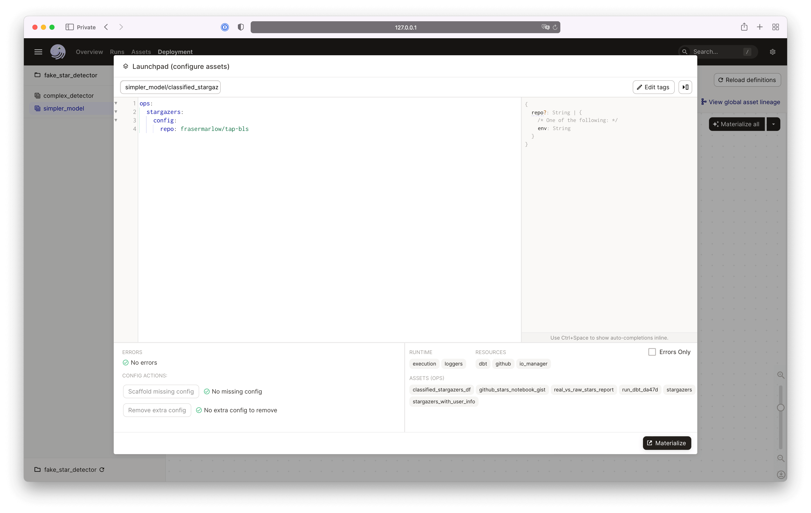
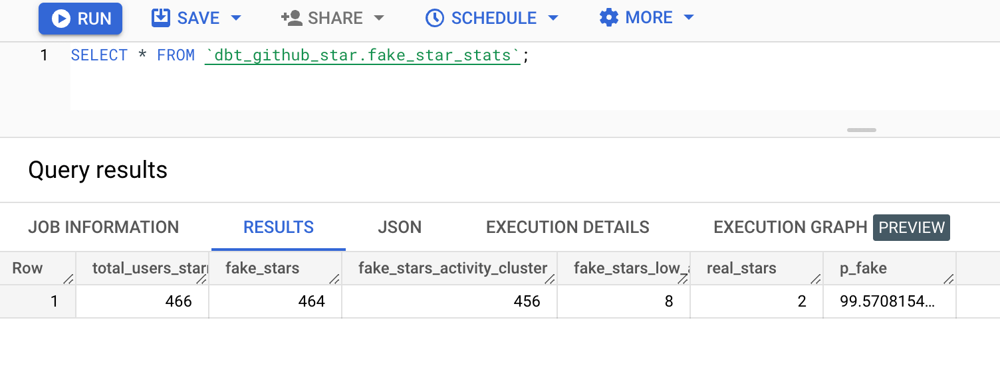

# fake-star-detector: A Dagster tutorial

This is a simple Dagster project to analyze the number of fake GitHub stars on any GitHub repository.  It is a companion to the blogpost found [on the Dagster blog](https:dagster.io/blog/fake-stars).


This project consists two models:
- [Simpler model](#trying-the-simpler-model-using-data-from-the-github-api): A simple model running “low activity” heuristic. This simple heuristic can detect many (but hardly all) suspected fake accounts that starred the same set of repositories, using nothing but data from the GitHub REST API (via [pygithub](https://github.com/PyGithub/PyGithub)).

- [Complex detector](#running-the-complex-model-using-bigquery-archive-data): An alternative detection model which runs a sophisticated clustering algorithm as well as the heuristic, using the public [GH Archive](https://www.gharchive.org) available in Bigquery. This model is written in SQL and uses [dbt](https://github.com/dbt-labs/dbt-core) alongside Dagster.
  * *Note: You can run this within the limits of a free-tier BQ account, but the analysis will be reduced in scope. By default, this model only scans data in 2023 on a small repository, in order to make it stay within the free-tier quota.*

<p align="center">
    
</p>

## Table of contents
- [Getting started](#getting-started)
    - [Install instructions](#install-instructions)
- [Trying the simpler model using data from the GitHub API](#trying-the-simpler-model-using-data-from-the-github-api)
    - [Running the model](#running-the-model)
    - [Explanation of the model](#explanation-of-the-model)
- [Running the complex model using BigQuery archive data](#running-the-complex-model-using-bigquery-archive-data)
    - [Prerequisites](#prerequisites)
    - [Running the model](#running-the-model-1)
    - [Explanation of the model](#explanation-of-the-model-1)


## Getting started

### Install instructions

For this tutorial, we assume you have Git installed. Installation details can be found here: https://github.com/git-guides/install-git
You will also need a GitHub Personal Access token to access the GitHub API.  This can be created in GitHub here: https://github.com/settings/tokens (after logging in to GitHub).  Keep the new access token handy as we will be needing it shortly.


Build a virtual environment
```commandline
python3 -m venv venv
source venv/bin/activate
```
Install Dagster and our other dependencies - see https://docs.dagster.io/getting-started/install
Note for M1 Mac users you may need to use `pip install dagster dagit --find-links=https://github.com/dagster-io/build-grpcio/wiki/Wheels`

Next you will need to pull a copy of this repository onto your local machine, go into the top level of the cloned repository and run the install command:

```commandline
git clone https://github.com/dagster-io/fake-star-detector.git
cd fake-star-detector
pip install -e ".[dev]"
```

If you have previously installed Dagster on your system, you may encounter the error 

Error: No such command 'dev'.

If this is the case, your system is likely trying to access the Dagster install outside of your vent. Try running the bash command `rehash` which will Recompute the internal hash table for the PATH variable, then repeat the `Dagster dev` command.

Next, create a `.env` file at the root of the repository you just cloned and add your GitHub access token as a variable variables:

```
GITHUB_ACCESS_TOKEN=<<GITHUB_ACCESS_TOKEN>>
```

Start the Dagster UI web server:

```commandline
dagster dev
```

Open http://localhost:3000 with your browser to see the project.

## Trying the simpler model using data from the GitHub API
<p align="center">
    
</p>

### Running the model

You can Shift+click "Materialize all" on the asset graph page to specify the repository you want to analyze in the configuration, such as:

```yaml
ops:
    raw_stargazers:
        config:
            repo: <insert name of the repo to analyze>
```


Shift+click "Materialize all"            |  Config editor
:-------------------------:|:-------------------------:
  |  

Then, click "Materialize" to kick off the simple model. In the end, you'll get a GitHub Gist with the results.

### Explanation of the model

This asset group is a Dagster project and involves 6 assets:

1) Asset `raw_stargazers`: We call the GitHub API and retrieve a list of users who have starred the repo.
2) Asset `stargazer_names_df`: We turn the GitHub response into a Pandas DataFrame.
3) Asset `stargazers_with_user_info`: We look up each user in turn and pull their detailed profile from the GitHub API.
4) Asset `classified_stargazers_df`: We analyze each profile and match it against our heuristic to determine if they are fake or not, and output a Pandas DataFrame.
5) Asset `real_vs_raw_stars_report`: We calculate the percentage of fake stars and output a report in raw Jupyter Notebook format.
6) Asset `github_stars_notebook_gist`: We convert the raw Jupyter Notebook into a Gist and output the URL to the Gist.

In addition to the above, we have a few helper functions:

a) `validate_star`: Matching a profile against the heuristic
b) `see_if_user_exists`: Verifying that a user still exists before pulling the full details
c) `handle_exception`: Handling exceptions for the GitHub API call.  This op calls on `get_retry_at` which returns the `x-ratelimit-reset`value for the GitHub API.

Currently, the pipeline will simply return a result in the Dagster UI as in `INFO` event type such as "Score is 12.34% fake stars" and will provide a list of usernames flagged as fake.

## Running the complex model using BigQuery archive data

This model is written in SQL and uses dbt. You can find the dbt project in the [`dbt_project`](./dbt_project/) directory, and the dbt models in the [`dbt_project/models/complex_detector/`](./dbt_project/models/complex_detector/) directory.

### Prerequisites

You will need to have a BigQuery account to run the dbt models. You can sign up for a free account [here](https://cloud.google.com/bigquery). Check out [Create a Google Service Account](https://dagster.io/blog/dagster-google-sheets-tutorial#create-a-google-service-account) to learn how to create a service account and download the JSON key file. This also requires BigQuery API enabled in your service account.

Next, you will need to add the credentials to your environment. You can do this by adding the following to your `.env` file:

```
DBT_BIGQUERY_KEYFILE_PATH='path to your JSON key file'
DBT_BIGQUERY_PROJECT='name of the bigquery project the output will write to'
DBT_BIGQUERY_DATASET='dbt_github_star' # or your desired bigquery dataset name
DBT_BIGQUERY_LOCATION='US' # or your desired location
```


### Running the model

Edit the "target_repo" in [`./dbt_project/models/fake_star_detector/stg_all_actions_for_actors_who_starred_repo.sql`](./dbt_project/models/complex_detector/stg_all_actions_for_actors_who_starred_repo.sql)
```

```

Next, click "Materialize" to kick off the complex model. In the end, you'll get a few BigQuery tables with the final result:

Tables and views in BigQuery           |  Final result
:-------------------------:|:-------------------------:
  |  


### Explanation of the model

This loads a dbt project which uses GitHub Archive data to identify suspicious users who starred the given repository, and estimates a FAKE STAR score for that repository using two separate heuristics
to catch different types of fake accounts.

<p align="center">
    
</p>

The dbt project materializes 4 BigQuery tables with estimated FAKE STAR score, and a few staging views:
1. `stg_all_actions_for_actors_who_starred_repo`: all activity for users who starred repo in the given time period
2. `starring_actor_summary`: table with 1 row per user, summarizing similarity to other users in a set.
3. `starring_actor_repo_summary`: table with 1 row per repo, summarizing similarity to other repositories actors touched.
4. `fake_star_stats`: fake star summary stats (FAKE STAR score).
