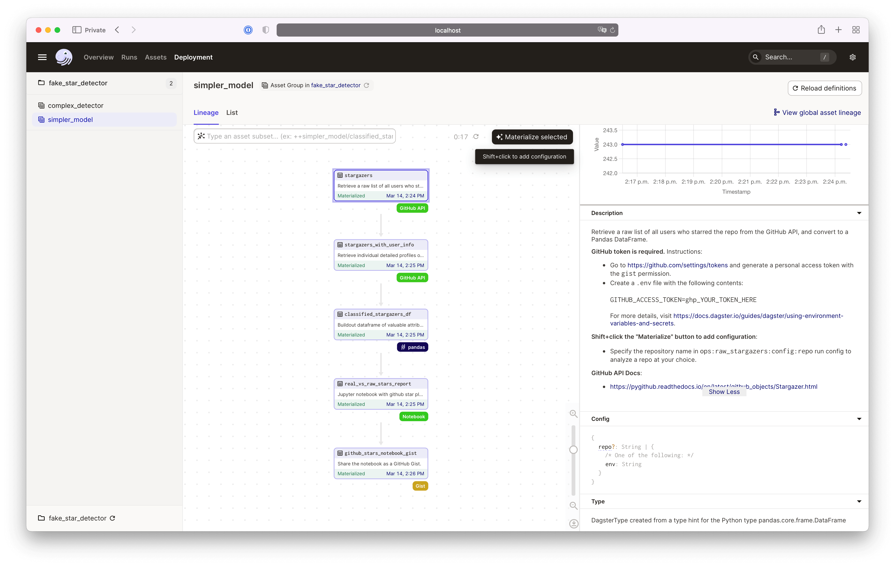

# fake-star-detector: A Dagster tutorial

This is a Dagster project to analyze the number of fake GitHub stars on any GitHub repository. It is a companion to the blogpost found [on the Dagster blog](https:dagster.io/blog).

This project consists two models:
- [Simpler model](#trying-the-simpler-model-using-data-from-the-github-api): A simple model running “low activity” heuristic. This simple heuristic can detect many (but hardly all) suspected fake accounts that starred the same set of repositories, using nothing but data from the GitHub REST API (via [pygithub](https://github.com/PyGithub/PyGithub)).

- [Complex detector](#running-the-complex-model-using-bigquery-archive-data): An alternative detection model which runs a sophisticated clustering algorithm as well as the heuristic, using the public [GH Archive](https://www.gharchive.org) available in Bigquery. This model is written in SQL and uses [dbt](https://github.com/dbt-labs/dbt-core) alongside Dagster.
  * *Note: You can run this within the limits of a free-tier BQ account, but the analysis will be reduced in scope. By default, this model only scans data in 2023 on a small repository, in order to make it stay within the free-tier quota.*

<p align="center">
    
</p>

## Getting started

### Install instructions

Build a virtual environment
```commandline
python3 -m venv venv
source venv/bin/activate
```
Install Dagster and our other dependencies - see https://docs.dagster.io/getting-started/install
Note for M1 Mac users you may need to use `pip install dagster dagit --find-links=https://github.com/dagster-io/build-grpcio/wiki/Wheels`

```commandline
pip install -e ".[dev]"
```

Next, create a `.env` file and add the required environment variables:
```
GITHUB_ACCESS_TOKEN=<<GITHUB_ACCESS_TOKEN>>
```

Start the Dagster UI web server:

```commandline
dagster dev
```

Open http://localhost:3000 with your browser to see the project.

## Trying the simpler model using data from the GitHub API
<p align="center">
    
</p>

### Specifying the repo to analyze

You can Shift+click "Materialize all" on the asset graph page to specify the repository you want to analyze in the configuration, such as:

```yaml
ops:
    raw_stargazers:
        config:
            repo: <insert name of the repo to analyze>
```


Shift+click "Materialize all"            |  Config editor
:-------------------------:|:-------------------------:
  |  


### Explanation of the model

This asset group is a Dagster project and involves 6 assets:

1) Asset `raw_stargazers`: We call the GitHub API and retrieve a list of users who have starred the repo.
2) Asset `stargazer_names_df`: We turn the GitHub response into a Pandas DataFrame.
3) Asset `stargazers_with_user_info`: We look up each user in turn and pull their detailed profile from the GitHub API.
4) Asset `classified_stargazers_df`: We analyze each profile and match it against our heuristic to determine if they are fake or not, and output a Pandas DataFrame.
5) Asset `real_vs_raw_stars_report`: We calculate the percentage of fake stars and output a report in raw Jupyter Notebook format.
6) Asset `github_stars_notebook_gist`: We convert the raw Jupyter Notebook into a Gist and output the URL to the Gist.

In addition to the above, we have a few helper functions:

a) `validate_star`: Matching a profile against the heuristic
b) `see_if_user_exists`: Verifying that a user still exists before pulling the full details
c) `handle_exception`: Handling exceptions for the GitHub API call.  This op calls on `get_retry_at` which returns the `x-ratelimit-reset`value for the GitHub API.

Currently, the pipeline will simply return a result in the Dagster UI as in `INFO` event type such as "Score is 12.34% fake stars" and will provide a list of usernames flagged as fake.

## Running the complex model using BigQuery archive data

### Explanation of the model
